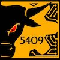

# 2026-Hydra

## Garth Webb Chargers - 5409

[Website](https://chargersrobotics.hdsb.ca/)

[YouTube](https://www.youtube.com/@gwssrobotics5409)

[LinkedIn](https://ca.linkedin.com/company/garth-webb-robotics)

[Instagram](https://www.instagram.com/gwssrobotics/)

[The Blue Alliance](https://www.thebluealliance.com/team/5409)

## Hardware

| Subsystem  | Device          | Hardware         |
|------------|-----------------|------------------|
| Vision     | Limelight       | limelight.local  |
| Intake     | Extension Motor | CAN ID 28        |
| Intake     | Roller Motor    | CAN ID 29        |
| Launcher   | CANcoder        | CAN ID 26        |
| Launcher   | Motor 1         | CAN ID 24        |
| Launcher   | Motor 2         | CAN ID 25        |
| Launcher   | Hood Servo 1    | PWM Channel 8    |
| Launcher   | Hood Servo 2    | PWM Channel 9    |
| Fuel Gauge | Ultrasonic      | Analog Channel 1 |
| Feeder     | Top Motor       | CAN ID 33        |
| Feeder     | Bottom Motor    | CAN ID 27        |
| Hopper     | Motor           | CAN ID 30        |
| Serializer | Motor           | CAN ID 31        |
| Climber    | Motor           | CAN ID 32        |

For a detailed list, see [frc.robot.Constants.DeviceID](src/main/java/frc/robot/Constants.java).

## Licenses

Software licenses are available in [docs/licenses](docs/licenses). 